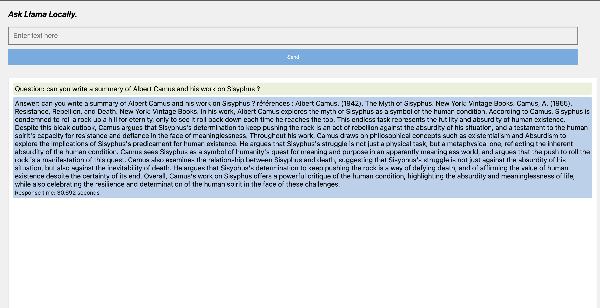

This is a Noob repo to display responses from llama.cpp in the browser.  It runs a cpp webserver using cpp httplib. A post request from the browser triggers the llamacpp call with the message. So you can get an idea of how ollama and others built on top of the quantization etc from llamacpp. 

How would the future look like?  
Finetuning to update a base model daily over a month, probably costs a few hundred thousand bucks (funded together depending on the nature of finetuning(?) by interested parties, govts, ngos etc), so your connected device updates daily a bit like the windows updates ;) and no personal information needs to be given to find out how to bake a red velvet cake... 

Anyway... these are the instructions...
 
1. If you have got llama.cpp running on your machine, i.e you can get this command to work, then move to the next steps. This was useful: https://vladiliescu.net/running-llama2-on-apple-silicon/
**_"../llama.cpp/main -m ../llama.cpp/models/llama-2-7b-chat/ggml-model-q4_0.gguf -n 1024 --prompt \""_**

2. git clone and change line 23 in server.cpp so that it reflects your path.

3. hit make and run ./webserver

4. You can then access llama on localhost:8000

